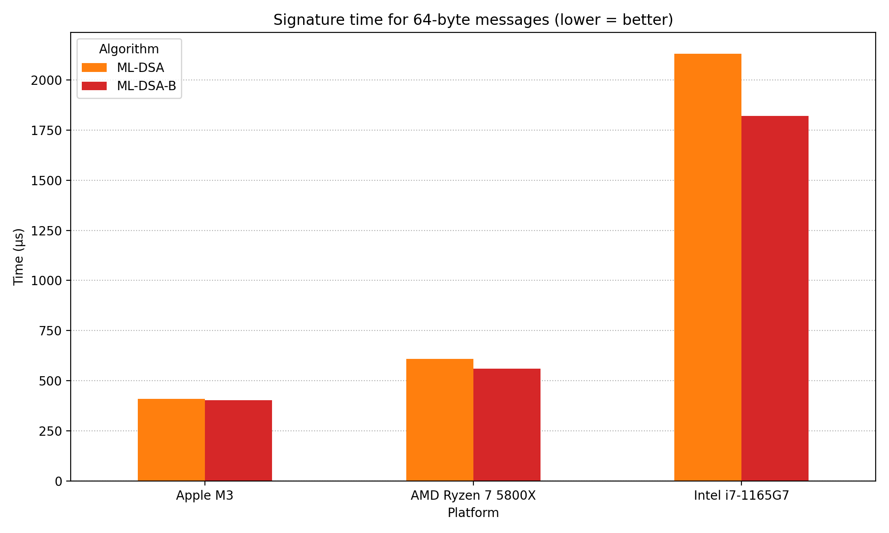
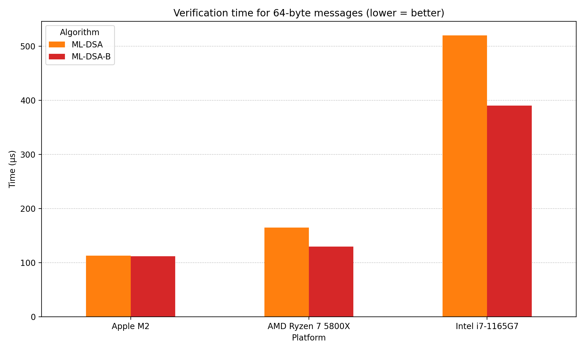
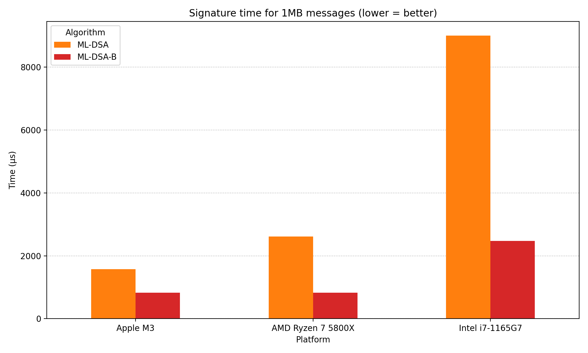

# PQC Suite B: Faster Post-Quantum Cryptography with BLAKE3

**Post-quantum signatures** spend a large share of their runtime on
hashing. We propose replacing their hash functions with
[BLAKE3](https://github.com/BLAKE3-team/BLAKE3/), the fastest
widely deployed cryptographic hash.

Authors:

- JP Aumasson / [@veorq](https://x.com/veorq), [Taurus](https://taurushq.com)
- Alex Pruden / [@apruden08](https://x.com/apruden08), [Project 11](https://www.projecteleven.com/)
- Conor Deegan / [@conor-deegan](https://x.com/ConorDeegan4), [Project 11](https://www.projecteleven.com/)
- Zooko Wilcox-O'Hearn / [@zooko](https://x.com/zooko), [Zcash](https://z.cash/)

## Why BLAKE3?

BLAKE3 is already integrated across diverse systems, from blockchains to
video games. It can serve as a drop-in replacement for any hashing
mode: regular hashing, keyed hashing (PRF), key derivation functions
(KDF), or extensible output functions (XOF).

BLAKE3 outperforms the SHA-2 and SHA-3 families and is even competitive
with hardware-accelerated SHA-256, as
[benchmarks](https://bench.cr.yp.to/primitives-hash.html) show.

Built on two decades of cryptanalytic scrutiny, BLAKE3 descends from
BLAKE (designed in 2008 as a SHA3 candidate), which itself derives from
ChaCha (a variant of the 2005 Salsa20 cipher).

Switching to BLAKE3 does not weaken security.

## Faster ML-DSA

[ML-DSA (FIPS 204)](https://csrc.nist.gov/pubs/fips/204/final) is
a lattice-based post-quantum signature scheme based on
[Dilithium](https://pq-crystals.org/dilithium/). It relies on the
SHA3-based functions SHAKE128 and SHAKE256.

We replace those with BLAKE3 and call the new scheme **ML-DSA-B**.

We ran [experimental
benchmarks](https://github.com/PQC-Suite-B/signatures/blob/b3/ml-dsa/HASHES.md),
modifying RustCrypto's ML-DSA with the [reference BLAKE3 Rust
code](https://crates.io/crates/blake3). Preliminary results show that,
depending on the platform, ML-DSA-B can offer the following speed-up:

1. Message pre-hash: up to 60 times faster.
2. Signature: up to 20% faster.
3. Verification: up to 30% faster.

On AMD and Intel CPUs, the speedups are most pronounced. On Apple ARM
SoCs, pre-hash remains much faster but the signature and verification
gains are smaller, as the figures below show:

## Independent results

* By @itzmeanjan: 
    - ML-DSA-B [C++ version](https://github.com/itzmeanjan/ml-dsa/tree/ml-dsa-b)
    - [Announcement](https://x.com/meanjanroy/status/1980955869178413544): "Keygen is 20% faster. Signing is 76% faster. Verify is 18% faster."

## Upcoming work

We plan to:

- Evaluate SLH-DSA-B, a variant of the hash heavy [SLH-DSA (FIPS 205)](https://csrc.nist.gov/pubs/fips/205/final) where BLAKE3 replaces 
  SHA256 and SHAKE. (Ongoing)

- This fork is temporarily pinned to an earlier [RustCrypto commit](https://github.com/RustCrypto/signatures/commit/f6df3e250c7634bdb72bb2f11e3a4f142be06678). We intend to re-sync with upstream (RustCrypto/signatures) to incorporate the latest ML-DSA changes.

- Create a C version of ML-DSA-B and produce test vectors to ensure consistency across implementations.

- Evaluate BLAKE3's impact on other post-quantum standards and candidates, including KEMs and NIST's [Additional](https://csrc.nist.gov/Projects/pqc-dig-sig/round-2-additional-signatures) signature schemes.
